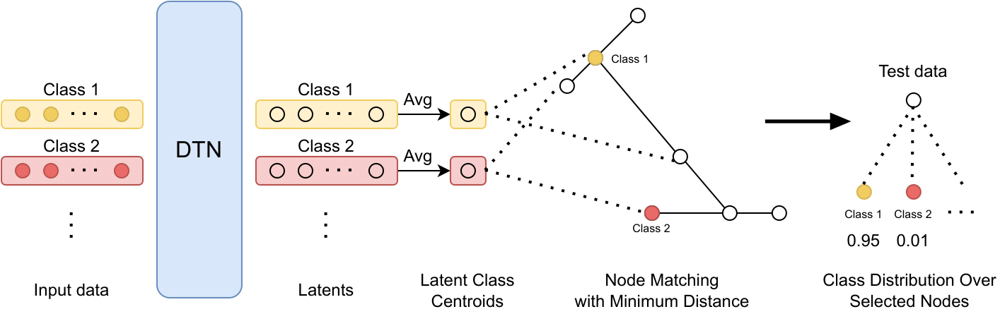

# Deep Taxonomic Networks for Unsupervised Prototype Discovery
<!--  -->
# Training
Run `python train-deep-taxonnet.py --config ./configs/fmnist.json` to train deep taxonomic network on Fashion-MNIST dataset using default configurations.

Few training configurations to play around:
- `dataset`: fashion-mnist, mnist, cifar-10
- `decoder_name`/`decoder_name`: __omniglot__ for 28x28 pixel data, __resnet18__ for 32x32 pixel data
- `enc_hidden_dim`: 128 for __omniglot__ encoder, 512 for __resnet18__
- `dec_hidden_dim`: [128, 1, 1] for __omniglot__ encoder, [512, 1, 1] for __resnet18__
  
You can use the provided `infer_latent_dim.ipynb` to calculate the dimenstions for images other than 32x32 or 28x28

# Testing
Load pre-trained models using `testing.ipynb` to calculate ACC, NMI, DP, LP for hierarchical clustering performance.

This repo provides pre-trained models on MNIST and Fashion MNIST under the `./models` folder.

# Visualization
Load pre-trained models using `viz_gen.ipynb` to visualize (sub-)tree. The provided nodebook can visualzie 1. clusters using the test images, and 2. clusters with model generated images.

# Citations
- ResNet-18 Encoder-Decoder was adopted (with modification to 32x32 image) from https://github.com/eleannavali/resnet-18-autoencoder (we didn't use the their 'light' version).

## How to use

The `scripts` folder contains shell commands for training Deep Taxonomic Network model.
The training configuration is stored as JSON files in the `scripts/configs/` folder
Run `run_config.sh` in slurm system.

<!-- The `encoder-decoder` folder contains several autoencoder architectures for experiments -->
 `encoder.py` and `decoder.py` stores the encoder and decoder architecure

<!-- `MiniDeepTaxonNet.py` is the same model but with vanilla autoencoder model such as simple CNN or simple MLP for the proof of concept experiments. -->

`train-deep-taxonnet.py` are the main training loops. The former one trains the autoencoder baseline model.

`DeepTaxonNet.py` is the main model.

`utils.py` contains all utility functions.

<!-- `DTN-basic-node-eval.ipynb` contains the main basic-level node probing evaluation logic: -->
<!--  -->

## How to use (Symbolic model)

### Installation
- Install the `cmake-build` branch at [Cobweb](https://github.com/Teachable-AI-Lab/cobweb/tree/cmake-build) 

***Moved to `cobweb_symbolic` folder***

`cobweb_symbolic.py` contains a wrapper class so you can have the cobweb tree in python.
See `cobweb-sym-example.ipynb`

The python version of the cobweb tree is a python *Dictionary* object with keys:
`mean, mean_sq, logvar, count, node_id, children`

Note that the parents in cobweb symbolic may have more than two chidlren so it is NOT a complete binary tree (you can see the tree in the following visualization).

The cobweb symbolic tree comes with a hyper-parameter `depth`. If you set the `depth` to infinity, the tree will keep expanding until it reaches the leaf determined by the Categorical Utility.

`COBWEBNN.py` contains the current version of the CobwebNN model

### Visualization
We use `D3.js` for visualization. **Line 55** of the `tree_viz.html` contains the JSON file name that we wish to visualize. Once a visualization JSON file is created, make sure you update the file name at **line 55**.

To run the HTML, go to your working directory, open terminal and run `python -m http.server 8080` (either `python` or `python3` is fine, depending on your environment. And if port 8080 is in use, you can use different port number).
Once the server is running, open a browser and go to `http://localhost:8080/tree_viz.html`, a tree will show up if you scroll the page to the right. Click the node to expand/close.
